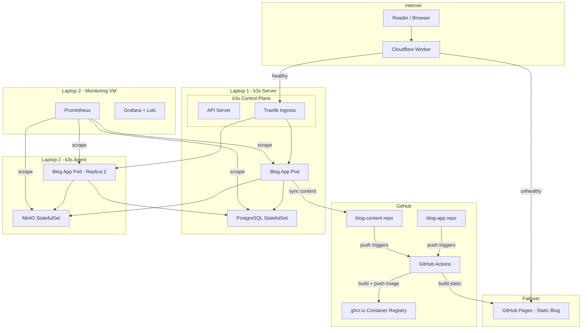

# blog.181094.xyz

A self-hosted, server-side rendered blog platform running on a 2-node k3s cluster (QEMU VMs on Proxmox laptops). Built with hand-crafted auth, OAuth commenting, S3-compatible image storage, automatic CDN failover, Kubernetes scaling, and Podman-based CI/CD.

## What This Project Demonstrates

- **Full-stack TypeScript**: Astro SSR, Drizzle ORM, hand-built OAuth2 and session management
- **Infrastructure engineering**: k3s on Proxmox, StatefulSets, HPA, PDB, rolling updates, cert-manager
- **Resilience design**: CDN failover via Cloudflare Worker, battery-backed compute nodes, wired networking with UPS
- **Production practices**: Load testing (k6), health checks, container builds (Podman), CI/CD (GitHub Actions)
- **Observability**: Prometheus + Grafana + Alertmanager in a dedicated monitoring VM, Loki for access log analytics

## Tech Stack

| Layer | Technology |
|---|---|
| SSR Framework | Astro 5 (Node adapter) |
| UI Components | @thundrex/web-components (LitElement) |
| Database | PostgreSQL 17 + Drizzle ORM |
| Object Storage | MinIO (S3-compatible) |
| Auth | Hand-built OAuth2 (GitHub, Google) + session management |
| Container Build | Podman + Buildah |
| Orchestration | k3s on QEMU VMs (Proxmox) |
| TLS | cert-manager + Let's Encrypt (DNS-01 via Cloudflare) |
| Edge / Failover | Cloudflare Worker + GitHub Pages static fallback |
| CI/CD | GitHub Actions |
| Monitoring | Prometheus + Grafana + Alertmanager (dedicated QEMU VM) |
| Log Analytics | Loki + Promtail (Traefik access logs for web analytics) |
| Alerting | Alertmanager -> Discord / Telegram |

## Documentation

| Document | Description |
|---|---|
| [Implementation Guide](docs/GUIDE.md) | Step-by-step build guide covering infrastructure, application, scaling, failover, and CI/CD |
| [High-Level Design](docs/HLD.md) | System architecture, requirements, capacity planning, API design, and availability strategy |
| [Low-Level Design](docs/LLD.md) | Module architecture, database schema with indexes, caching strategy, auth pseudocode, and security layers |
| [AI Usage Guide](docs/AI-USAGE.md) | Where to use AI as a multiplier and where to write code yourself for maximum learning |

## Architecture Overview

## Timeline

| Weekend | Phase | Deliverable |
|---|---|---|
| 1 | k3s cluster + PostgreSQL + MinIO | 2-node cluster running, databases accessible |
| 2 | Blog app: content, admin, markdown rendering | SSR blog reading posts from GitHub, admin panel working |
| 3 | Auth + comments + image upload + deploy | OAuth login, commenting, MinIO images, blog.181094.xyz live |
| 4 | Scaling: HPA, probes, PDB, load testing | Understand exactly where the system breaks |
| 4-5 | Failover: static site + Cloudflare Worker | Blog stays readable when power goes out |
| 5 | CI/CD: Podman + GitHub Actions | Push code, auto-deploy to k3s |
| 5-6 | Polish, first blog post | Write "Building a Resilient Homelab Blog" as the inaugural post |
| 6-7 | Monitoring: Prometheus + Grafana + Alertmanager | Dedicated monitoring VM watching all hosts, VMs, services, and websites |

## Repo Structure

- **hybridx/blog** -- Astro app, k8s manifests, Containerfile, CI/CD workflows, Cloudflare Worker
- **hybridx/blog-content** -- Pure markdown files + image references (separate repo for independent static rebuilds)
- **hybridx/blog-backups** (private) -- Database backup dumps from CronJob

## License

MIT
