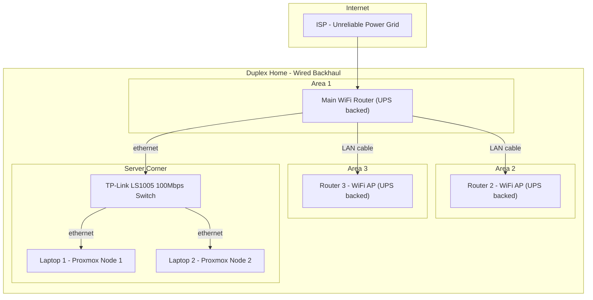

# Self-Hosted Blog Platform: Implementation Guide

> Build a production-grade, self-hosted blog from scratch on a 2-node Kubernetes cluster running on consumer laptops with unreliable power. Covers SSR, hand-built OAuth and session auth, S3-compatible image storage, automatic CDN failover, Kubernetes scaling, and CI/CD -- all using TypeScript, Astro, PostgreSQL, MinIO, k3s, Podman, and Cloudflare.

## Who This Guide Is For

This guide is for engineers who want to understand the full stack -- not just use frameworks, but know how they work underneath. It's written as a learning project: the auth is hand-built (no Auth.js), the caching is hand-built, and the infrastructure runs on real hardware you control.

By the end, you'll have:

- A working blog at `blog.181094.xyz` with SSR, OAuth comments, and image hosting
- A 2-node k3s cluster you built and understand
- Hand-written OAuth2, session management, CSRF protection, and rate limiting
- Automatic failover to a static site when your server is offline
- A system you can walk through in a system design interview because you built every layer

## Prerequisites

- Two machines running Proxmox VE (this guide uses laptops for built-in battery backup)
- A domain name with DNS managed by Cloudflare (for DDNS, TLS, and failover)
- A GitHub account (for content storage, OAuth, container registry, and CI/CD)
- A Google Cloud Console project (for Google OAuth -- optional, can start with GitHub only)
- Basic familiarity with Linux, Docker/Podman, and command-line tools

---

## Hardware and Network Layout



**Network architecture**: Duplex home with wired backhaul throughout. Main router connects to additional routers in other areas via LAN cables (not WiFi repeaters -- no bandwidth loss from wireless hopping). All routers have UPS backup for power resilience. The two Proxmox laptops connect via ethernet through the TP-Link 5-port switch. The entire data path from laptops to ISP is wired. WiFi is only for client devices (phones, tablets) in each room.

**Proxmox context**: The two nodes are NOT a Proxmox cluster. Proxmox clustering caused kernel panics because corosync's self-fencing mechanism intentionally panics the kernel when 2-node quorum is lost (which happens on any brief network interruption -- a fundamental limitation of 2-node clusters, not a bug). They run as independent Proxmox instances. k3s creates the cluster layer on top with much more graceful failure handling (marks nodes NotReady and reschedules pods instead of panicking).

- **Laptop 1** (8GB RAM): Independent Proxmox node, runs k3s server VM (4096MB -- control plane + worker)
- **Laptop 2** (8GB RAM): Independent Proxmox node, runs k3s agent VM (3072MB -- worker) + Monitoring VM (2048MB -- Prometheus, Grafana, Alertmanager, Loki)
- **Inter-node network**: 100Mbps wired ethernet via TP-Link switch (fully wired, stable, sufficient for k3s)
- **Internet path**: fully wired -- laptops -> switch -> main router -> ISP
- **Home coverage**: wired routers (not repeaters) providing WiFi per area of duplex, each with UPS
- **Power resilience**: unreliable grid, laptops provide ~1hr battery failover, UPS on all networking gear

---

## Phase 1: k3s Cluster on Proxmox (Weekend 1)

We use QEMU VMs (not LXC containers) for k3s. VMs have full kernel isolation, so k3s works without any hacks -- no apparmor config, no cgroup workarounds, no kmsg fixes. The trade-off is ~200MB more RAM overhead per node compared to LXC, but it eliminates an entire class of compatibility issues and makes the setup reproducible and reliable.

**Why QEMU over LXC for k3s:**

- LXC shares the host kernel. k3s needs specific kernel modules (overlay, br_netfilter), cgroup access, and mount capabilities that require hacking the LXC config. If Proxmox or the kernel updates, the hacks can break.
- QEMU VMs run their own kernel. k3s installs cleanly with zero modifications. What works today will work after every Proxmox update.
- The ~200MB RAM cost per node is worth the reliability. With 8GB per laptop and Proxmox using ~400-500MB, you have plenty of room for VMs. k3s server runs comfortably with 4GB.

### Step 1.1: Download Ubuntu Cloud Image

On each Proxmox host, download the Ubuntu 24.04 cloud image. Cloud images are pre-built, minimal, and boot in seconds with cloud-init (no interactive installer needed).

SSH into Proxmox host on **Laptop 1**:

```bash
cd /var/lib/vz/template/iso/
wget https://cloud-images.ubuntu.com/noble/current/noble-server-cloudimg-amd64.img
```

Repeat on **Laptop 2**.

### Step 1.2: Create QEMU VM on Laptop 1 (k3s Server)

SSH into Proxmox host on Laptop 1:

```bash
# Create the VM (ID 200)
qm create 200 --name k3s-server --memory 4096 --cores 2 --net0 virtio,bridge=vmbr0

# Import the cloud image as the VM's disk
qm importdisk 200 /var/lib/vz/template/iso/noble-server-cloudimg-amd64.img local-lvm

# Attach the imported disk as the boot drive
qm set 200 --scsihw virtio-scsi-pci --scsi0 local-lvm:vm-200-disk-0

# Resize the disk to 20GB (cloud image is ~3GB by default)
qm resize 200 scsi0 20G

# Add a cloud-init drive (for setting hostname, SSH keys, static IP)
qm set 200 --ide2 local-lvm:cloudinit

# Set boot order to disk
qm set 200 --boot c --bootdisk scsi0

# Enable the QEMU guest agent
qm set 200 --agent enabled=1

# Configure cloud-init settings
qm set 200 --ciuser deepesh
qm set 200 --cipassword <your-password>
qm set 200 --ipconfig0 ip=192.168.1.10/24,gw=192.168.1.1
qm set 200 --nameserver 192.168.1.1
qm set 200 --searchdomain local

# Optional: add your SSH public key for passwordless access
qm set 200 --sshkeys ~/.ssh/authorized_keys

# Start the VM
qm start 200
```

Wait ~30 seconds for cloud-init to finish, then SSH in:

```bash
ssh deepesh@192.168.1.10
```

### Step 1.3: Prepare the VM for k3s

Inside the k3s-server VM:

```bash
# Update system
sudo apt update && sudo apt upgrade -y
sudo apt install -y curl wget open-iscsi

# Disable swap (required by Kubernetes)
sudo swapoff -a
sudo sed -i '/ swap / s/^/#/' /etc/fstab

# Load required kernel modules
cat <<EOF | sudo tee /etc/modules-load.d/k3s.conf
overlay
br_netfilter
EOF
sudo modprobe overlay
sudo modprobe br_netfilter

# Set required sysctl params
cat <<EOF | sudo tee /etc/sysctl.d/k3s.conf
net.bridge.bridge-nf-call-iptables = 1
net.bridge.bridge-nf-call-ip6tables = 1
net.ipv4.ip_forward = 1
EOF
sudo sysctl --system
```

**Why these steps matter (understand, don't just copy):**

- `overlay` and `br_netfilter`: kernel modules that container networking depends on. `overlay` enables overlay filesystems (how container layers work). `br_netfilter` lets iptables see bridged traffic (how k8s network policies work).
- `net.ipv4.ip_forward = 1`: allows the VM to forward packets between network interfaces -- required because pods on different nodes need to communicate through the VM's network stack.
- `net.bridge.bridge-nf-call-iptables = 1`: ensures bridged traffic goes through iptables rules, which is how k8s Services and NetworkPolicies are implemented.
- `swapoff`: Kubernetes doesn't work well with swap because the scheduler assumes memory limits are hard. If a pod hits its memory limit, it should be OOM-killed, not swapped (which would silently degrade performance).

### Step 1.4: Install k3s Server on Laptop 1

```bash
curl -sfL https://get.k3s.io | sudo sh -s - \
  --write-kubeconfig-mode 644 \
  --node-name k3s-server \
  --tls-san 192.168.1.10 \
  --disable servicelb \
  --flannel-iface enp0s18

# Verify it's running
sudo systemctl status k3s
sudo kubectl get nodes
# Should show: k3s-server   Ready   control-plane,master
```

**What each flag does:**

- `--write-kubeconfig-mode 644`: makes kubeconfig readable without sudo (default is 600/root-only)
- `--node-name k3s-server`: explicit node name instead of using hostname
- `--tls-san 192.168.1.10`: adds this IP to the API server's TLS certificate, so you can connect from your dev machine using the IP
- `--disable servicelb`: disables k3s's built-in ServiceLB (Klipper). Traefik handles ingress directly.
- `--flannel-iface enp0s18`: forces flannel (k3s's CNI plugin) to use the ethernet interface. In a QEMU VM, the interface is typically `enp0s18` or `ens18`. Check with `ip addr` and use whatever shows your 192.168.1.x IP.

Save the join token (needed for Laptop 2):

```bash
sudo cat /var/lib/rancher/k3s/server/node-token
```

Copy kubeconfig to your dev machine:

```bash
sudo cat /etc/rancher/k3s/k3s.yaml
# Copy this file to your dev machine at ~/.kube/config
# IMPORTANT: replace "127.0.0.1" with "192.168.1.10" in the file
```

### Step 1.5: Create QEMU VM on Laptop 2 (k3s Agent)

SSH into Proxmox host on Laptop 2. Same process as Step 1.2 but with different ID and IP:

```bash
qm create 200 --name k3s-agent --memory 3072 --cores 2 --net0 virtio,bridge=vmbr0

qm importdisk 200 /var/lib/vz/template/iso/noble-server-cloudimg-amd64.img local-lvm
qm set 200 --scsihw virtio-scsi-pci --scsi0 local-lvm:vm-200-disk-0
qm resize 200 scsi0 20G
qm set 200 --ide2 local-lvm:cloudinit
qm set 200 --boot c --bootdisk scsi0
qm set 200 --agent enabled=1

# Cloud-init with DIFFERENT IP
qm set 200 --ciuser deepesh
qm set 200 --cipassword <your-password>
qm set 200 --ipconfig0 ip=192.168.1.11/24,gw=192.168.1.1
qm set 200 --nameserver 192.168.1.1
qm set 200 --sshkeys ~/.ssh/authorized_keys

qm start 200
```

SSH in and run the same preparation steps (Step 1.3):

```bash
ssh deepesh@192.168.1.11
# Run all the apt, swap, kernel module, and sysctl commands from Step 1.3
```

### Step 1.6: Install k3s Agent on Laptop 2

```bash
curl -sfL https://get.k3s.io | K3S_URL=https://192.168.1.10:6443 K3S_TOKEN=<paste-token-from-step-1.4> sudo sh -s - \
  --node-name k3s-agent \
  --flannel-iface enp0s18
```

**What this does:** installs k3s in agent mode. The agent connects to the server at `192.168.1.10:6443`, authenticates with the token, and joins the cluster as a worker node. It runs kubelet and kube-proxy but no control plane components.

### Step 1.7: Verify Cluster Health

From your dev machine (or the k3s-server VM):

```bash
kubectl get nodes -o wide
# Should show:
# NAME          STATUS   ROLES                  AGE   VERSION   INTERNAL-IP     ...
# k3s-server    Ready    control-plane,master   Xm    v1.xx.x   192.168.1.10   ...
# k3s-agent     Ready    <none>                 Xm    v1.xx.x   192.168.1.11   ...

kubectl get pods -A
# Should show system pods running:
# kube-system   coredns-xxx         Running   (DNS)
# kube-system   traefik-xxx         Running   (Ingress controller)
# kube-system   metrics-server-xxx  Running   (Resource metrics)
# kube-system   local-path-xxx      Running   (Storage provisioner)

kubectl top nodes
# Shows CPU and memory usage per node -- verify you have headroom
```

**If a node shows NotReady:** check that the VMs can ping each other (`ping 192.168.1.10` from the agent VM). If they can't, it's a Proxmox network bridge issue -- verify both VMs use `vmbr0` and that bridge is connected to the ethernet interface on each laptop.

### Step 1.8: Test Cross-Node Communication

This verifies that flannel networking works across your two laptops:

```bash
kubectl run test-server --image=nginx --overrides='{"spec":{"nodeSelector":{"kubernetes.io/hostname":"k3s-server"}}}'
kubectl run test-agent --image=nginx --overrides='{"spec":{"nodeSelector":{"kubernetes.io/hostname":"k3s-agent"}}}'

kubectl get pods -o wide
# Note the Pod IPs (10.42.x.x range)

kubectl exec test-server -- curl -s <test-agent-pod-ip>
# Should return nginx welcome page HTML

kubectl delete pod test-server test-agent
```

**Why this test matters:** if this works, it proves flannel's VXLAN overlay is correctly tunneling traffic between your two laptops over the ethernet switch. All k3s pod-to-pod communication depends on this. If this fails, nothing else will work.

### Troubleshooting Phase 1

| Problem | Likely Cause | Fix |
|---|---|---|
| `kubectl get nodes` shows NotReady | Agent can't reach server on port 6443 | Check firewall: `sudo ufw status`. If active, allow 6443, 8472/udp (flannel), 10250. |
| Flannel pods in CrashLoopBackOff | Wrong `--flannel-iface` | Run `ip addr` in the VM, find the interface with your 192.168.1.x IP, pass that to `--flannel-iface` |
| VM can't get IP via cloud-init | Cloud-init drive not attached | Verify `ide2` is set to cloudinit in Proxmox VM config |
| Cross-node pod communication fails | VXLAN port blocked | Ensure UDP port 8472 is open between the two VMs (flannel uses this for overlay traffic) |
| `kubectl top nodes` returns error | Metrics server not ready yet | Wait 2-3 minutes after cluster creation. Metrics server needs time to collect data. |

---

## Phase 2: Core Services -- PostgreSQL and MinIO (Weekend 1-2)

### Step 2.1: Create Blog Namespace

```bash
kubectl create namespace blog
kubectl config set-context --current --namespace=blog
```

### Step 2.2: PostgreSQL StatefulSet

Create file `k8s/postgres-secret.yaml`:

```yaml
apiVersion: v1
kind: Secret
metadata:
  name: postgres-credentials
  namespace: blog
type: Opaque
stringData:
  POSTGRES_USER: blog
  POSTGRES_PASSWORD: <generate-a-strong-password>
  POSTGRES_DB: blog
```

Create file `k8s/postgres-statefulset.yaml`:

```yaml
apiVersion: apps/v1
kind: StatefulSet
metadata:
  name: postgres
  namespace: blog
spec:
  serviceName: postgres
  replicas: 1
  selector:
    matchLabels:
      app: postgres
  template:
    metadata:
      labels:
        app: postgres
    spec:
      nodeSelector:
        kubernetes.io/hostname: k3s-server
      containers:
        - name: postgres
          image: postgres:17-alpine
          ports:
            - containerPort: 5432
          envFrom:
            - secretRef:
                name: postgres-credentials
          volumeMounts:
            - name: postgres-data
              mountPath: /var/lib/postgresql/data
          resources:
            requests:
              memory: "256Mi"
              cpu: "200m"
            limits:
              memory: "512Mi"
              cpu: "1000m"
          livenessProbe:
            exec:
              command: ["pg_isready", "-U", "blog"]
            initialDelaySeconds: 30
            periodSeconds: 10
          readinessProbe:
            exec:
              command: ["pg_isready", "-U", "blog"]
            initialDelaySeconds: 5
            periodSeconds: 5
  volumeClaimTemplates:
    - metadata:
        name: postgres-data
      spec:
        accessModes: ["ReadWriteOnce"]
        storageClassName: local-path
        resources:
          requests:
            storage: 2Gi
---
apiVersion: v1
kind: Service
metadata:
  name: postgres
  namespace: blog
spec:
  selector:
    app: postgres
  ports:
    - port: 5432
  clusterIP: None
```

Apply:

```bash
kubectl apply -f k8s/postgres-secret.yaml
kubectl apply -f k8s/postgres-statefulset.yaml

kubectl get pods -n blog
# postgres-0 should be Running

kubectl exec -it postgres-0 -n blog -- psql -U blog -d blog -c "SELECT 1;"
```

### Step 2.3: MinIO StatefulSet

Create file `k8s/minio-secret.yaml`:

```yaml
apiVersion: v1
kind: Secret
metadata:
  name: minio-credentials
  namespace: blog
type: Opaque
stringData:
  MINIO_ROOT_USER: minioadmin
  MINIO_ROOT_PASSWORD: <generate-a-strong-password>
```

Create file `k8s/minio-statefulset.yaml`:

```yaml
apiVersion: apps/v1
kind: StatefulSet
metadata:
  name: minio
  namespace: blog
spec:
  serviceName: minio
  replicas: 1
  selector:
    matchLabels:
      app: minio
  template:
    metadata:
      labels:
        app: minio
    spec:
      nodeSelector:
        kubernetes.io/hostname: k3s-agent
      containers:
        - name: minio
          image: minio/minio:latest
          args: ["server", "/data", "--console-address", ":9001"]
          ports:
            - containerPort: 9000
            - containerPort: 9001
          envFrom:
            - secretRef:
                name: minio-credentials
          volumeMounts:
            - name: minio-data
              mountPath: /data
          resources:
            requests:
              memory: "256Mi"
              cpu: "200m"
            limits:
              memory: "512Mi"
              cpu: "1000m"
          livenessProbe:
            httpGet:
              path: /minio/health/live
              port: 9000
            initialDelaySeconds: 10
            periodSeconds: 10
          readinessProbe:
            httpGet:
              path: /minio/health/ready
              port: 9000
            initialDelaySeconds: 5
            periodSeconds: 5
  volumeClaimTemplates:
    - metadata:
        name: minio-data
      spec:
        accessModes: ["ReadWriteOnce"]
        storageClassName: local-path
        resources:
          requests:
            storage: 5Gi
---
apiVersion: v1
kind: Service
metadata:
  name: minio
  namespace: blog
spec:
  selector:
    app: minio
  ports:
    - name: api
      port: 9000
    - name: console
      port: 9001
  clusterIP: None
```

Apply:

```bash
kubectl apply -f k8s/minio-secret.yaml
kubectl apply -f k8s/minio-statefulset.yaml

kubectl get pods -n blog
# minio-0 should be Running

kubectl port-forward svc/minio 9001:9001 -n blog
# Open http://localhost:9001, login, create bucket "blog-images"
```

### Step 2.4: Database Backup CronJob

Create file `k8s/backup-cronjob.yaml`:

```yaml
apiVersion: batch/v1
kind: CronJob
metadata:
  name: postgres-backup
  namespace: blog
spec:
  schedule: "0 */6 * * *"
  jobTemplate:
    spec:
      template:
        spec:
          containers:
            - name: backup
              image: postgres:17-alpine
              command:
                - /bin/sh
                - -c
                - |
                  TIMESTAMP=$(date +%Y%m%d_%H%M%S)
                  pg_dump -h postgres -U blog blog | gzip > /backups/blog_${TIMESTAMP}.sql.gz
                  ls -t /backups/*.sql.gz | tail -n +11 | xargs rm -f 2>/dev/null
                  echo "Backup completed: blog_${TIMESTAMP}.sql.gz"
              envFrom:
                - secretRef:
                    name: postgres-credentials
              env:
                - name: PGPASSWORD
                  valueFrom:
                    secretKeyRef:
                      name: postgres-credentials
                      key: POSTGRES_PASSWORD
              volumeMounts:
                - name: backup-storage
                  mountPath: /backups
          restartPolicy: OnFailure
          volumes:
            - name: backup-storage
              hostPath:
                path: /var/lib/blog-backups
                type: DirectoryOrCreate
```

---

## Phase 3: Blog Application (Weekend 2-3)

### Step 3.1: Initialize the Project

On your dev machine:

```bash
npm create astro@latest blog -- --template minimal
cd blog
npx astro add node
npm install pg drizzle-orm drizzle-kit
npm install marked sanitize-html argon2
npm install @thundrex/web-components
npm install -D @types/sanitize-html
```

### Step 3.2: Project Structure

```
blog/
  src/
    pages/
      index.astro                    # Homepage - post listing
      blog/[slug].astro              # Individual post (SSR)
      admin/
        index.astro                  # Admin dashboard
        login.astro                  # Admin login form
        write.astro                  # Markdown editor
        edit/[slug].astro            # Edit post
        images.astro                 # MinIO image manager
      api/
        auth/
          github.ts                  # GitHub OAuth redirect + callback
          google.ts                  # Google OAuth redirect + callback
          logout.ts                  # Destroy session
          me.ts                      # Current user info
        comments.ts                  # CRUD comments
        images/
          upload.ts                  # Upload image to MinIO
          [key].ts                   # Serve image from MinIO (or presigned URL)
        webhook.ts                   # GitHub content webhook
        health.ts                    # Health check for Cloudflare
    components/
      PostCard.astro
      CommentList.astro
      CommentForm.astro
      AdminNav.astro
      MarkdownEditor.astro
      LoginButtons.astro
      ImageUploader.astro
    layouts/
      Base.astro                     # Imports @thundrex/web-components
      BlogPost.astro
      Admin.astro                    # Auth guard via middleware
    lib/
      db.ts                          # Drizzle client setup
      github.ts                      # GitHub API: fetch/push content
      cache.ts                       # In-memory Map + fs L2 cache
      markdown.ts                    # marked + sanitize-html pipeline
      minio.ts                       # MinIO S3 client
      auth/
        oauth.ts                     # Generic OAuth2 auth code flow
        session.ts                   # Session CRUD with crypto
        csrf.ts                      # CSRF token gen/validate
        middleware.ts                # Astro middleware
        admin.ts                     # Admin credential check (argon2)
        ratelimit.ts                 # DB-backed rate limiting
        providers/
          github.ts                  # GitHub OAuth endpoints + scopes
          google.ts                  # Google OAuth endpoints + scopes
      comments/
        service.ts                   # CRUD logic
        sanitize.ts                  # Input sanitization
    middleware.ts                     # Astro middleware entry
  drizzle/
    schema.ts                        # Users, sessions, comments tables
    migrations/
  Containerfile
  astro.config.ts
  drizzle.config.ts
  package.json
```

### Step 3.3: What You Build By Hand (the learning)

**OAuth2 Flow** (`src/lib/auth/oauth.ts`):

- `generateAuthUrl(provider)` -- builds the authorization URL with client_id, redirect_uri, scope, state
- `handleCallback(provider, code, state)` -- exchanges code for token via `fetch` POST, fetches user profile, upserts user in DB, creates session
- State parameter: random string stored in a short-lived cookie, validated on callback to prevent CSRF on the OAuth flow itself
- No libraries. Just `fetch`, `crypto`, and your provider configs.

**Session Management** (`src/lib/auth/session.ts`):

- `createSession(userId)` -- generates `crypto.randomBytes(32).toString('hex')`, inserts into sessions table with 7-day expiry, returns token
- `validateSession(token)` -- queries sessions table, checks expiry, returns user or null
- `destroySession(token)` -- deletes from sessions table
- `setSessionCookie(response, token)` -- sets `Set-Cookie` with HttpOnly, Secure, SameSite=Lax, Path=/, Max-Age
- `clearSessionCookie(response)` -- sets expired cookie

**CSRF** (`src/lib/auth/csrf.ts`):

- `generateCsrfToken()` -- `crypto.randomBytes(32).toString('hex')`, stored alongside session in DB
- `validateCsrfToken(request, session)` -- reads token from `X-CSRF-Token` header or form body, compares with session's stored token
- Injected into pages via Astro SSR: `<meta name="csrf-token" content={csrfToken} />`

**Rate Limiting** (`src/lib/auth/ratelimit.ts`):

- `checkRateLimit(key, action, maxCount, windowMinutes)` -- queries DB for count of actions in window, returns allow/deny
- Applied in middleware for login attempts (3 per 15 min per IP) and comments (10 per hour per user)

**Content Cache** (`src/lib/cache.ts`):

- L1: in-memory `Map<string, {content, parsedAt, etag}>` -- fastest, lost on restart
- L2: filesystem (`/tmp/blog-cache/`) -- survives app restart, lost on pod restart
- On cache miss: fetch from GitHub API, parse markdown, store in L1 + L2
- Invalidation: webhook from GitHub triggers `cache.clear()`, next request repopulates
- Polling fallback: every 5 minutes, check GitHub API for new commits on content repo

**MinIO Image Client** (`src/lib/minio.ts`):

- Use the `minio` npm package (it's just an S3 client, not application logic)
- `uploadImage(file, key)` -- upload to `blog-images` bucket
- `getImageUrl(key)` -- generate presigned URL (valid 7 days) or proxy through your API
- `listImages()` -- list objects in bucket for the admin image manager
- `deleteImage(key)` -- remove from bucket

**Comments Service** (`src/lib/comments/service.ts`):

- `createComment(postSlug, userId, content)` -- sanitize content, check rate limit, insert into DB
- `getComments(postSlug)` -- fetch comments with user info (name, avatar), ordered by createdAt
- `deleteComment(commentId, userId, isAdmin)` -- owner or admin can delete
- Input flows through sanitization pipeline: raw text -> `marked` (if markdown enabled) -> `sanitize-html` (strip dangerous HTML) -> store

### Step 3.4: Database Schema

```typescript
// drizzle/schema.ts
import { pgTable, uuid, varchar, text, boolean, timestamp, integer } from 'drizzle-orm/pg-core';

export const users = pgTable('users', {
  id: uuid('id').defaultRandom().primaryKey(),
  name: varchar('name', { length: 255 }).notNull(),
  email: varchar('email', { length: 255 }),
  image: text('image'),
  provider: varchar('provider', { length: 50 }).notNull(),
  providerId: varchar('provider_id', { length: 255 }).notNull(),
  isAdmin: boolean('is_admin').default(false),
  createdAt: timestamp('created_at').defaultNow(),
});

export const sessions = pgTable('sessions', {
  id: uuid('id').defaultRandom().primaryKey(),
  token: varchar('token', { length: 64 }).notNull().unique(),
  csrfToken: varchar('csrf_token', { length: 64 }).notNull(),
  userId: uuid('user_id').references(() => users.id).notNull(),
  expiresAt: timestamp('expires_at').notNull(),
  createdAt: timestamp('created_at').defaultNow(),
});

export const comments = pgTable('comments', {
  id: uuid('id').defaultRandom().primaryKey(),
  postSlug: varchar('post_slug', { length: 255 }).notNull(),
  userId: uuid('user_id').references(() => users.id).notNull(),
  content: text('content').notNull(),
  createdAt: timestamp('created_at').defaultNow(),
  updatedAt: timestamp('updated_at'),
});
```

Run migrations:

```bash
npx drizzle-kit generate
npx drizzle-kit push
```

### Step 3.5: Containerfile (Podman)

```dockerfile
# Stage 1: Build
FROM node:22-alpine AS builder
WORKDIR /app
COPY package*.json ./
RUN npm ci
COPY . .
RUN npm run build

# Stage 2: Run
FROM node:22-alpine
WORKDIR /app
COPY --from=builder /app/dist ./dist
COPY --from=builder /app/node_modules ./node_modules
COPY --from=builder /app/package.json ./
ENV HOST=0.0.0.0
ENV PORT=4321
EXPOSE 4321
HEALTHCHECK --interval=30s --timeout=3s CMD wget -q --spider http://localhost:4321/api/health || exit 1
CMD ["node", "dist/server/entry.mjs"]
```

Build and test locally:

```bash
podman build -t blog:dev -f Containerfile .
podman run -p 4321:4321 --env-file .env blog:dev
```

---

## Phase 4: Deploy to k3s (Weekend 3)

### Step 4.1: Push Image to GHCR

```bash
podman login ghcr.io -u hybridx
podman tag blog:dev ghcr.io/hybridx/blog:latest
podman push ghcr.io/hybridx/blog:latest
```

### Step 4.2: Create k8s Image Pull Secret

```bash
kubectl create secret docker-registry ghcr-secret \
  --docker-server=ghcr.io \
  --docker-username=hybridx \
  --docker-password=<github-pat-with-packages-read> \
  -n blog
```

### Step 4.3: Blog App Secrets

Create file `k8s/blog-secret.yaml`:

```yaml
apiVersion: v1
kind: Secret
metadata:
  name: blog-secrets
  namespace: blog
type: Opaque
stringData:
  DATABASE_URL: "postgresql://blog:<pg-password>@postgres:5432/blog"
  GITHUB_CLIENT_ID: "<from github oauth app>"
  GITHUB_CLIENT_SECRET: "<from github oauth app>"
  GOOGLE_CLIENT_ID: "<from google cloud console>"
  GOOGLE_CLIENT_SECRET: "<from google cloud console>"
  GITHUB_PAT: "<fine-grained-pat-for-content-repo>"
  ADMIN_USER: "deepesh"
  ADMIN_PASS_HASH: "<argon2-hash-of-your-password>"
  MINIO_ENDPOINT: "minio:9000"
  MINIO_ACCESS_KEY: "minioadmin"
  MINIO_SECRET_KEY: "<your-minio-password>"
  SESSION_SECRET: "<random-64-char-string>"
```

### Step 4.4: Blog Deployment

Create file `k8s/blog-deployment.yaml`:

```yaml
apiVersion: apps/v1
kind: Deployment
metadata:
  name: blog
  namespace: blog
spec:
  replicas: 2
  strategy:
    type: RollingUpdate
    rollingUpdate:
      maxUnavailable: 1
      maxSurge: 1
  selector:
    matchLabels:
      app: blog
  template:
    metadata:
      labels:
        app: blog
    spec:
      imagePullSecrets:
        - name: ghcr-secret
      topologySpreadConstraints:
        - maxSkew: 1
          topologyKey: kubernetes.io/hostname
          whenUnsatisfiable: DoNotSchedule
          labelSelector:
            matchLabels:
              app: blog
      containers:
        - name: blog
          image: ghcr.io/hybridx/blog:latest
          ports:
            - containerPort: 4321
          envFrom:
            - secretRef:
                name: blog-secrets
          resources:
            requests:
              memory: "256Mi"
              cpu: "200m"
            limits:
              memory: "512Mi"
              cpu: "1000m"
          readinessProbe:
            httpGet:
              path: /api/health
              port: 4321
            initialDelaySeconds: 5
            periodSeconds: 10
            failureThreshold: 3
          livenessProbe:
            httpGet:
              path: /api/health
              port: 4321
            initialDelaySeconds: 15
            periodSeconds: 20
            failureThreshold: 3
          startupProbe:
            httpGet:
              path: /api/health
              port: 4321
            failureThreshold: 30
            periodSeconds: 2
---
apiVersion: v1
kind: Service
metadata:
  name: blog
  namespace: blog
spec:
  selector:
    app: blog
  ports:
    - port: 80
      targetPort: 4321
```

**What the probes do:**

- **startupProbe**: gives the app up to 60 seconds to start (30 x 2s). Prevents liveness probe from killing a slow-starting pod.
- **readinessProbe**: checks every 10s if the pod can serve traffic. If it fails 3 times, pod is removed from the Service (no traffic routed to it) but NOT killed.
- **livenessProbe**: checks every 20s if the pod is alive. If it fails 3 times, kubelet kills and restarts the pod.

### Step 4.5: Ingress and TLS

Install cert-manager:

```bash
kubectl apply -f https://github.com/cert-manager/cert-manager/releases/download/v1.17.0/cert-manager.yaml
kubectl wait --for=condition=Ready pods --all -n cert-manager --timeout=120s
```

Create file `k8s/cert-issuer.yaml`:

```yaml
apiVersion: cert-manager.io/v1
kind: ClusterIssuer
metadata:
  name: letsencrypt
spec:
  acme:
    server: https://acme-v02.api.letsencrypt.org/directory
    email: hybridx@example.com
    privateKeySecretRef:
      name: letsencrypt-key
    solvers:
      - dns01:
          cloudflare:
            apiTokenSecretRef:
              name: cloudflare-api-token
              key: api-token
```

Create file `k8s/blog-ingress.yaml`:

```yaml
apiVersion: networking.k8s.io/v1
kind: Ingress
metadata:
  name: blog
  namespace: blog
  annotations:
    cert-manager.io/cluster-issuer: letsencrypt
spec:
  tls:
    - hosts:
        - blog.181094.xyz
      secretName: blog-tls
  rules:
    - host: blog.181094.xyz
      http:
        paths:
          - path: /
            pathType: Prefix
            backend:
              service:
                name: blog
                port:
                  number: 80
```

### Step 4.6: DNS Setup in Cloudflare

1. Go to Cloudflare dashboard -> `181094.xyz` zone
2. Add DNS record:
   - **Type**: A (or CNAME if using DDNS hostname)
   - **Name**: `blog`
   - **Content**: your homelab public IP
   - **Proxy**: OFF (you handle TLS yourself via cert-manager)
   - **TTL**: Auto
3. Your existing DDNS script should update this record when your IP changes

### Step 4.7: Apply Everything

```bash
kubectl apply -f k8s/
kubectl get pods -n blog -w

curl -I https://blog.181094.xyz/api/health
# Should return 200 OK
```

---

## Phase 5: Scaling -- The Full Picture (Weekend 4)

### Step 5.1: Resource Budget

With 8GB per laptop and Proxmox using ~500MB, each VM gets generous allocations. Budget per VM:

```
Laptop 1 VM (k3s-server, 4096MB):
  k3s control plane:   ~300MB (API server, scheduler, controller-manager, SQLite)
  Traefik:             ~80MB
  cert-manager:        ~100MB
  PostgreSQL:           512MB limit
  Blog Pod 1:           512MB limit
  postgres_exporter:    ~50MB
  Remaining:            ~2.5GB buffer (headroom for HPA pods, future services)

Laptop 2 VM (k3s-agent, 3072MB):
  k3s agent:            ~200MB (kubelet, flannel, kube-proxy)
  MinIO:                512MB limit
  Blog Pod 2:           512MB limit
  Remaining:            ~1.8GB buffer (absorbs HPA scaling to pods 3-6)
```

Laptop 2 also runs the **Monitoring VM** (2048MB) separately -- see Phase 9.

### Step 5.2: Horizontal Pod Autoscaler (HPA)

```bash
kubectl get deployment metrics-server -n kube-system
kubectl top pods -n blog
```

Create file `k8s/blog-hpa.yaml`:

```yaml
apiVersion: autoscaling/v2
kind: HorizontalPodAutoscaler
metadata:
  name: blog
  namespace: blog
spec:
  scaleTargetRef:
    apiVersion: apps/v1
    kind: Deployment
    name: blog
  minReplicas: 2
  maxReplicas: 6
  metrics:
    - type: Resource
      resource:
        name: cpu
        target:
          type: Utilization
          averageUtilization: 70
    - type: Resource
      resource:
        name: memory
        target:
          type: Utilization
          averageUtilization: 80
  behavior:
    scaleUp:
      stabilizationWindowSeconds: 60
      policies:
        - type: Pods
          value: 1
          periodSeconds: 60
    scaleDown:
      stabilizationWindowSeconds: 300
      policies:
        - type: Pods
          value: 1
          periodSeconds: 120
```

**What this teaches you:**

- HPA watches metrics-server for CPU/memory usage
- When average CPU across all blog pods exceeds 70%, it adds a pod (up to 4 max)
- Scale-down is slower (5 min stabilization) to prevent flapping
- On your 2-node cluster, 6 pods means up to 3 per node -- with 512MB per pod limit and ~2GB+ buffer per VM, there's plenty of room

### Step 5.3: Pod Disruption Budget (PDB)

Create file `k8s/blog-pdb.yaml`:

```yaml
apiVersion: policy/v1
kind: PodDisruptionBudget
metadata:
  name: blog
  namespace: blog
spec:
  minAvailable: 1
  selector:
    matchLabels:
      app: blog
```

### Step 5.4: Test Rolling Updates

```bash
kubectl set image deployment/blog blog=ghcr.io/hybridx/blog:<new-sha> -n blog
kubectl rollout status deployment/blog -n blog
kubectl rollout history deployment/blog -n blog
kubectl rollout undo deployment/blog -n blog
```

### Step 5.5: Load Testing with k6

Install k6:

```bash
brew install k6
```

Create `load-test.js`:

```javascript
import http from 'k6/http';
import { check, sleep } from 'k6';

export const options = {
  stages: [
    { duration: '30s', target: 10 },
    { duration: '1m', target: 50 },
    { duration: '30s', target: 100 },
    { duration: '1m', target: 100 },
    { duration: '30s', target: 0 },
  ],
};

export default function () {
  const res = http.get('https://blog.181094.xyz/blog/my-first-post');
  check(res, {
    'status is 200': (r) => r.status === 200,
    'response time < 500ms': (r) => r.timings.duration < 500,
  });
  sleep(1);
}
```

Run: `k6 run load-test.js`

**What to observe:**

- Watch `kubectl top pods -n blog` during the test
- Watch `kubectl get hpa -n blog -w` to see HPA react
- At what point do response times degrade? That's your bottleneck.

**Common bottlenecks:**

| Bottleneck | Symptom | Fix |
|---|---|---|
| SSR rendering CPU | High CPU on blog pods, slow response times | HPA scales pods (already configured) |
| PostgreSQL connections | Connection errors under load | Add connection pooling (PgBouncer) or use Drizzle's pool config |
| Cache misses | Every request hits GitHub API | Verify L1/L2 cache is working |
| MinIO image serving | Slow image loads | Use presigned URLs instead of proxying through the app |
| Network between nodes | Cross-node pod communication slow | 100Mbps is the hard limit -- keep heavy traffic node-local |

### Step 5.6: When to Add Redis (Conditional)

**Do NOT add Redis upfront.** Run the load test first. Add Redis ONLY if you observe:

1. **Session lookup bottleneck**: every request queries PostgreSQL for sessions. If PG CPU is high from session queries, move sessions to Redis.
2. **Cache duplication**: L1 is per-pod. If cache miss rate is high because traffic bounces between pods, add Redis as shared cache.
3. **Rate limiting under load**: DB-backed counting gets slow at high request rates. Redis `INCR` with `EXPIRE` is O(1).

**If you do add Redis:**

```yaml
# k8s/redis-deployment.yaml
apiVersion: apps/v1
kind: Deployment
metadata:
  name: redis
  namespace: blog
spec:
  replicas: 1
  selector:
    matchLabels:
      app: redis
  template:
    spec:
      containers:
        - name: redis
          image: redis:7-alpine
          ports:
            - containerPort: 6379
          resources:
            requests:
              memory: "128Mi"
              cpu: "100m"
            limits:
              memory: "256Mi"
              cpu: "500m"
          command: ["redis-server", "--maxmemory", "128mb", "--maxmemory-policy", "allkeys-lru"]
```

---

## Phase 6: Cloudflare Failover (Weekend 4-5)

### Step 6.1: Build Static Fallback

Create a second Astro config for static export:

```typescript
// astro.config.static.ts
import { defineConfig } from 'astro/config';
export default defineConfig({
  output: 'static',
  site: 'https://blog.181094.xyz',
});
```

GitHub Actions workflow (`.github/workflows/static-fallback.yml`):

```yaml
name: Build Static Fallback
on:
  push:
    branches: [main]
  repository_dispatch:
    types: [content-updated]

jobs:
  build:
    runs-on: ubuntu-latest
    steps:
      - uses: actions/checkout@v4
      - uses: actions/setup-node@v4
        with:
          node-version: 22
      - run: npm ci
      - name: Fetch content from GitHub
        run: node scripts/fetch-content.js
        env:
          GITHUB_PAT: ${{ secrets.CONTENT_PAT }}
      - run: npx astro build --config astro.config.static.ts
      - uses: actions/deploy-pages@v4
        with:
          artifact_name: github-pages
```

Static version has all blog posts as HTML. Comments section shows a banner: "Comments available when the server is online."

### Step 6.2: Cloudflare Worker

Create `cloudflare-worker/index.js`:

```javascript
const ORIGIN = 'https://blog.181094.xyz';
const FALLBACK = 'https://hybridx.github.io/blog-static';
let originHealthy = true;
let lastCheck = 0;
let consecutiveFailures = 0;

async function checkHealth() {
  if (Date.now() - lastCheck < 30000) return;
  lastCheck = Date.now();
  try {
    const res = await fetch(`${ORIGIN}/api/health`, {
      signal: AbortSignal.timeout(4000)
    });
    if (res.ok) {
      consecutiveFailures = 0;
      originHealthy = true;
    } else {
      consecutiveFailures++;
    }
  } catch {
    consecutiveFailures++;
  }
  if (consecutiveFailures >= 2) originHealthy = false;
}

export default {
  async fetch(request) {
    await checkHealth();
    const url = new URL(request.url);
    if (originHealthy) {
      try {
        const res = await fetch(request);
        if (res.status < 500) return res;
      } catch {}
    }
    const fallbackUrl = `${FALLBACK}${url.pathname}`;
    const res = await fetch(fallbackUrl);
    return new Response(res.body, {
      status: res.status,
      headers: { ...Object.fromEntries(res.headers), 'X-Served-By': 'fallback' },
    });
  }
};
```

Deploy: `npx wrangler deploy cloudflare-worker/index.js --route "blog.181094.xyz/*"`

---

## Phase 7: CI/CD with Podman (Weekend 5)

`.github/workflows/deploy.yml`:

```yaml
name: Build and Deploy
on:
  push:
    branches: [main]

jobs:
  build:
    runs-on: ubuntu-latest
    steps:
      - uses: actions/checkout@v4
      - name: Install Podman
        run: sudo apt-get update && sudo apt-get install -y podman
      - name: Build image
        run: podman build -t ghcr.io/hybridx/blog:${{ github.sha }} -f Containerfile .
      - name: Tag latest
        run: podman tag ghcr.io/hybridx/blog:${{ github.sha }} ghcr.io/hybridx/blog:latest
      - name: Login to GHCR
        run: echo "${{ secrets.GITHUB_TOKEN }}" | podman login ghcr.io -u hybridx --password-stdin
      - name: Push images
        run: |
          podman push ghcr.io/hybridx/blog:${{ github.sha }}
          podman push ghcr.io/hybridx/blog:latest

  deploy:
    needs: build
    runs-on: ubuntu-latest
    steps:
      - name: Deploy to k3s
        uses: appleboy/ssh-action@v1
        with:
          host: blog.181094.xyz
          username: deploy
          key: ${{ secrets.SSH_KEY }}
          script: |
            kubectl set image deployment/blog blog=ghcr.io/hybridx/blog:${{ github.sha }} -n blog
            kubectl rollout status deployment/blog -n blog --timeout=120s
```

---

## Phase 8: Monitoring and Launch (Weekend 5-6)

### Step 8.1: Health Check Endpoint

```typescript
// src/pages/api/health.ts
export async function GET() {
  const checks = {
    database: false,
    cache: false,
    minio: false,
    uptime: process.uptime(),
  };

  try {
    await db.execute(sql`SELECT 1`);
    checks.database = true;
  } catch {}

  checks.cache = cache.size > 0 || cache.lastRefresh !== null;

  try {
    checks.minio = true;
  } catch {}

  const healthy = checks.database;
  return new Response(JSON.stringify(checks), {
    status: healthy ? 200 : 503,
  });
}
```

### Step 8.2: Monitoring

See **Phase 9** for the full industry-standard monitoring setup with Prometheus, Grafana, and Alertmanager in a dedicated VM. For quick ad-hoc checks during development:

```bash
kubectl top pods -n blog    # CPU/memory per pod
kubectl top nodes            # CPU/memory per node
kubectl get hpa -n blog     # Current HPA state
curl -s https://blog.181094.xyz/api/health | jq  # App health
```

---

## Phase 9: Monitoring -- Prometheus, Grafana, Alertmanager (Weekend 6-7)

This phase sets up a dedicated monitoring VM that watches **everything** -- both Proxmox hosts, the k3s cluster, all application services, and any external websites. This is an industry-standard observability stack that runs independently from k3s so it can alert you when k3s itself goes down.

### Why a Dedicated VM (Not Inside k3s)

- If k3s crashes, monitoring inside k3s dies with it -- you'd never get an alert
- Prometheus needs to scrape the Proxmox hosts directly (outside k8s)
- This VM serves all your projects, not just the blog
- Clear separation: k3s runs workloads, monitoring VM watches everything

### Step 9.1: Create Monitoring VM on Laptop 2

SSH into Proxmox host on Laptop 2:

```bash
# Create monitoring VM (ID 201, separate from k3s-agent VM 200)
qm create 201 --name monitoring --memory 2048 --cores 2 --net0 virtio,bridge=vmbr0

qm importdisk 201 /var/lib/vz/template/iso/noble-server-cloudimg-amd64.img local-lvm
qm set 201 --scsihw virtio-scsi-pci --scsi0 local-lvm:vm-201-disk-0
qm resize 201 scsi0 30G
qm set 201 --ide2 local-lvm:cloudinit
qm set 201 --boot c --bootdisk scsi0
qm set 201 --agent enabled=1

qm set 201 --ciuser deepesh
qm set 201 --cipassword <your-password>
qm set 201 --ipconfig0 ip=192.168.1.12/24,gw=192.168.1.1
qm set 201 --nameserver 192.168.1.1
qm set 201 --sshkeys ~/.ssh/authorized_keys

qm start 201
```

**Why Laptop 2:** If Laptop 1 (k3s control plane) goes down, monitoring on Laptop 2 still detects and alerts you. If Laptop 2 goes down, k3s on Laptop 1 marks the agent NotReady and you can check from the control plane directly.

### Step 9.2: Install Node Exporter on Every Host

Node Exporter exposes system metrics (CPU, RAM, disk, network) on port 9100. Install it on:
- Both Proxmox hosts (bare metal)
- The k3s-server VM
- The k3s-agent VM
- The monitoring VM itself

On each machine:

```bash
# Download and install Node Exporter
curl -LO https://github.com/prometheus/node_exporter/releases/download/v1.9.0/node_exporter-1.9.0.linux-amd64.tar.gz
tar xzf node_exporter-1.9.0.linux-amd64.tar.gz
sudo mv node_exporter-1.9.0.linux-amd64/node_exporter /usr/local/bin/

# Create systemd service
sudo tee /etc/systemd/system/node_exporter.service <<'EOF'
[Unit]
Description=Node Exporter
After=network.target

[Service]
User=nobody
ExecStart=/usr/local/bin/node_exporter
Restart=always

[Install]
WantedBy=multi-user.target
EOF

sudo systemctl daemon-reload
sudo systemctl enable --now node_exporter

# Verify
curl -s http://localhost:9100/metrics | head -5
```

### Step 9.3: Install Prometheus

SSH into the monitoring VM (`192.168.1.12`):

```bash
# Create prometheus user
sudo useradd --no-create-home --shell /bin/false prometheus
sudo mkdir -p /etc/prometheus /var/lib/prometheus

# Download Prometheus
curl -LO https://github.com/prometheus/prometheus/releases/download/v3.2.1/prometheus-3.2.1.linux-amd64.tar.gz
tar xzf prometheus-3.2.1.linux-amd64.tar.gz
sudo mv prometheus-3.2.1.linux-amd64/prometheus /usr/local/bin/
sudo mv prometheus-3.2.1.linux-amd64/promtool /usr/local/bin/
sudo chown prometheus:prometheus /usr/local/bin/prometheus /usr/local/bin/promtool
sudo chown -R prometheus:prometheus /var/lib/prometheus
```

Create Prometheus config:

```bash
sudo tee /etc/prometheus/prometheus.yml <<'EOF'
global:
  scrape_interval: 15s
  evaluation_interval: 15s

alerting:
  alertmanagers:
    - static_configs:
        - targets: ['localhost:9093']

rule_files:
  - '/etc/prometheus/rules/*.yml'

scrape_configs:
  # Monitor Prometheus itself
  - job_name: 'prometheus'
    static_configs:
      - targets: ['localhost:9090']

  # Proxmox Host 1 (bare metal)
  - job_name: 'proxmox-host-1'
    static_configs:
      - targets: ['192.168.1.x:9100']  # Replace with actual Proxmox host IP
        labels:
          host: 'laptop-1'
          role: 'proxmox-host'

  # Proxmox Host 2 (bare metal)
  - job_name: 'proxmox-host-2'
    static_configs:
      - targets: ['192.168.1.x:9100']  # Replace with actual Proxmox host IP
        labels:
          host: 'laptop-2'
          role: 'proxmox-host'

  # k3s Server VM
  - job_name: 'k3s-server-vm'
    static_configs:
      - targets: ['192.168.1.10:9100']
        labels:
          host: 'k3s-server'
          role: 'k3s-control-plane'

  # k3s Agent VM
  - job_name: 'k3s-agent-vm'
    static_configs:
      - targets: ['192.168.1.11:9100']
        labels:
          host: 'k3s-agent'
          role: 'k3s-worker'

  # Monitoring VM itself
  - job_name: 'monitoring-vm'
    static_configs:
      - targets: ['localhost:9100']
        labels:
          host: 'monitoring'
          role: 'monitoring'

  # k3s API Server metrics
  - job_name: 'k3s-apiserver'
    scheme: https
    tls_config:
      insecure_skip_verify: true
    bearer_token_file: /etc/prometheus/k3s-token
    static_configs:
      - targets: ['192.168.1.10:6443']

  # MinIO built-in metrics
  - job_name: 'minio'
    metrics_path: /minio/v2/metrics/cluster
    scheme: http
    static_configs:
      - targets: ['192.168.1.11:9000']  # MinIO NodePort or port-forward

  # PostgreSQL (via postgres_exporter running in k3s)
  - job_name: 'postgresql'
    static_configs:
      - targets: ['192.168.1.10:9187']  # postgres_exporter NodePort

  # Blog app custom metrics (add /metrics endpoint to your app)
  - job_name: 'blog-app'
    static_configs:
      - targets: ['192.168.1.10:4321']  # Blog NodePort
    metrics_path: /api/metrics

  # External website probing via blackbox_exporter
  - job_name: 'blackbox-http'
    metrics_path: /probe
    params:
      module: [http_2xx]
    static_configs:
      - targets:
          - https://blog.181094.xyz
          - https://181094.xyz
          # Add any other websites here
    relabel_configs:
      - source_labels: [__address__]
        target_label: __param_target
      - source_labels: [__param_target]
        target_label: instance
      - target_label: __address__
        replacement: localhost:9115
EOF
```

Create systemd service:

```bash
sudo tee /etc/systemd/system/prometheus.service <<'EOF'
[Unit]
Description=Prometheus
After=network.target

[Service]
User=prometheus
ExecStart=/usr/local/bin/prometheus \
  --config.file=/etc/prometheus/prometheus.yml \
  --storage.tsdb.path=/var/lib/prometheus/ \
  --storage.tsdb.retention.time=30d \
  --web.enable-lifecycle
Restart=always

[Install]
WantedBy=multi-user.target
EOF

sudo systemctl daemon-reload
sudo systemctl enable --now prometheus

# Verify
curl -s http://localhost:9090/-/healthy
```

**What `--storage.tsdb.retention.time=30d` does:** keeps 30 days of metrics data. With ~10 scrape targets at 15s intervals, this uses roughly 500MB-1GB of disk. The 30GB disk on this VM has plenty of room.

### Step 9.4: Install Alertmanager

```bash
curl -LO https://github.com/prometheus/alertmanager/releases/download/v0.28.1/alertmanager-0.28.1.linux-amd64.tar.gz
tar xzf alertmanager-0.28.1.linux-amd64.tar.gz
sudo mv alertmanager-0.28.1.linux-amd64/alertmanager /usr/local/bin/

sudo mkdir -p /etc/alertmanager

sudo tee /etc/alertmanager/alertmanager.yml <<'EOF'
global:
  resolve_timeout: 5m

route:
  group_by: ['alertname', 'job']
  group_wait: 30s
  group_interval: 5m
  repeat_interval: 4h
  receiver: 'discord'

receivers:
  - name: 'discord'
    discord_configs:
      - webhook_url: '<your-discord-webhook-url>'
        title: '{{ .GroupLabels.alertname }}'
        message: '{{ range .Alerts }}{{ .Annotations.summary }}{{ end }}'
  # Or use Telegram:
  # - name: 'telegram'
  #   telegram_configs:
  #     - bot_token: '<your-bot-token>'
  #       chat_id: <your-chat-id>
EOF

sudo tee /etc/systemd/system/alertmanager.service <<'EOF'
[Unit]
Description=Alertmanager
After=network.target

[Service]
User=prometheus
ExecStart=/usr/local/bin/alertmanager \
  --config.file=/etc/alertmanager/alertmanager.yml \
  --storage.path=/var/lib/alertmanager/
Restart=always

[Install]
WantedBy=multi-user.target
EOF

sudo systemctl daemon-reload
sudo systemctl enable --now alertmanager
```

### Step 9.5: Create Alert Rules

```bash
sudo mkdir -p /etc/prometheus/rules

sudo tee /etc/prometheus/rules/homelab.yml <<'EOF'
groups:
  - name: node
    rules:
      - alert: NodeDown
        expr: up == 0
        for: 1m
        labels:
          severity: critical
        annotations:
          summary: '{{ $labels.instance }} is down'

      - alert: HighCPU
        expr: 100 - (avg by(instance) (rate(node_cpu_seconds_total{mode="idle"}[5m])) * 100) > 85
        for: 5m
        labels:
          severity: warning
        annotations:
          summary: 'CPU > 85% on {{ $labels.instance }}'

      - alert: HighMemory
        expr: (1 - node_memory_MemAvailable_bytes / node_memory_MemTotal_bytes) * 100 > 90
        for: 5m
        labels:
          severity: warning
        annotations:
          summary: 'Memory > 90% on {{ $labels.instance }}'

      - alert: DiskAlmostFull
        expr: (1 - node_filesystem_avail_bytes{mountpoint="/"} / node_filesystem_size_bytes{mountpoint="/"}) * 100 > 85
        for: 10m
        labels:
          severity: warning
        annotations:
          summary: 'Disk > 85% on {{ $labels.instance }}'

  - name: blog
    rules:
      - alert: BlogDown
        expr: probe_success{job="blackbox-http", instance="https://blog.181094.xyz"} == 0
        for: 2m
        labels:
          severity: critical
        annotations:
          summary: 'blog.181094.xyz is unreachable'

      - alert: SSLExpiringSoon
        expr: probe_ssl_earliest_cert_expiry - time() < 7 * 24 * 3600
        for: 1h
        labels:
          severity: warning
        annotations:
          summary: 'SSL cert expires in < 7 days for {{ $labels.instance }}'

      - alert: HighResponseTime
        expr: probe_http_duration_seconds{phase="transfer"} > 2
        for: 5m
        labels:
          severity: warning
        annotations:
          summary: 'Response time > 2s for {{ $labels.instance }}'

  - name: postgresql
    rules:
      - alert: PostgreSQLDown
        expr: pg_up == 0
        for: 1m
        labels:
          severity: critical
        annotations:
          summary: 'PostgreSQL is down'

      - alert: TooManyConnections
        expr: pg_stat_database_numbackends / pg_settings_max_connections * 100 > 80
        for: 5m
        labels:
          severity: warning
        annotations:
          summary: 'PostgreSQL connections > 80% of max'
EOF

# Validate and reload
promtool check rules /etc/prometheus/rules/homelab.yml
curl -X POST http://localhost:9090/-/reload
```

### Step 9.6: Install Blackbox Exporter

Blackbox exporter probes external URLs (HTTP, TCP, ICMP, DNS) so Prometheus can track uptime, response time, and SSL certificate expiry for your websites.

```bash
curl -LO https://github.com/prometheus/blackbox_exporter/releases/download/v0.26.0/blackbox_exporter-0.26.0.linux-amd64.tar.gz
tar xzf blackbox_exporter-0.26.0.linux-amd64.tar.gz
sudo mv blackbox_exporter-0.26.0.linux-amd64/blackbox_exporter /usr/local/bin/

sudo mkdir -p /etc/blackbox_exporter

sudo tee /etc/blackbox_exporter/config.yml <<'EOF'
modules:
  http_2xx:
    prober: http
    timeout: 5s
    http:
      valid_http_versions: ["HTTP/1.1", "HTTP/2.0"]
      valid_status_codes: [200]
      follow_redirects: true
      preferred_ip_protocol: ip4
  icmp:
    prober: icmp
    timeout: 5s
EOF

sudo tee /etc/systemd/system/blackbox_exporter.service <<'EOF'
[Unit]
Description=Blackbox Exporter
After=network.target

[Service]
User=prometheus
ExecStart=/usr/local/bin/blackbox_exporter --config.file=/etc/blackbox_exporter/config.yml
Restart=always

[Install]
WantedBy=multi-user.target
EOF

sudo systemctl daemon-reload
sudo systemctl enable --now blackbox_exporter
```

### Step 9.7: Install postgres_exporter in k3s

Deploy postgres_exporter as a pod inside k3s that scrapes your PostgreSQL and exposes metrics for Prometheus to collect.

```yaml
# k8s/postgres-exporter.yaml
apiVersion: apps/v1
kind: Deployment
metadata:
  name: postgres-exporter
  namespace: blog
spec:
  replicas: 1
  selector:
    matchLabels:
      app: postgres-exporter
  template:
    metadata:
      labels:
        app: postgres-exporter
    spec:
      containers:
        - name: postgres-exporter
          image: prometheuscommunity/postgres-exporter:v0.16.0
          ports:
            - containerPort: 9187
          env:
            - name: DATA_SOURCE_NAME
              value: "postgresql://blog:<pg-password>@postgres:5432/blog?sslmode=disable"
          resources:
            requests:
              memory: "32Mi"
              cpu: "50m"
            limits:
              memory: "64Mi"
              cpu: "200m"
---
apiVersion: v1
kind: Service
metadata:
  name: postgres-exporter
  namespace: blog
spec:
  type: NodePort
  selector:
    app: postgres-exporter
  ports:
    - port: 9187
      targetPort: 9187
      nodePort: 30187
```

Apply: `kubectl apply -f k8s/postgres-exporter.yaml`

The NodePort (30187) makes it accessible from the monitoring VM at `192.168.1.10:30187`.

### Step 9.8: Install Grafana

```bash
# Install Grafana from the official APT repo
sudo apt-get install -y apt-transport-https software-properties-common
sudo mkdir -p /etc/apt/keyrings/
wget -q -O - https://apt.grafana.com/gpg.key | gpg --dearmor | sudo tee /etc/apt/keyrings/grafana.gpg > /dev/null
echo "deb [signed-by=/etc/apt/keyrings/grafana.gpg] https://apt.grafana.com stable main" | sudo tee /etc/apt/sources.list.d/grafana.list
sudo apt-get update
sudo apt-get install -y grafana

# Start Grafana
sudo systemctl enable --now grafana-server

# Grafana is now available at http://192.168.1.12:3000
# Default login: admin / admin (change on first login)
```

**Configure Prometheus as a data source:**

1. Open `http://192.168.1.12:3000` in your browser
2. Go to Configuration -> Data Sources -> Add data source
3. Select Prometheus
4. URL: `http://localhost:9090`
5. Click "Save & Test"

**Import community dashboards:**

Go to Dashboards -> Import and use these dashboard IDs:

| Dashboard ID | Name | What it shows |
|---|---|---|
| 1860 | Node Exporter Full | CPU, memory, disk, network per host/VM |
| 9628 | PostgreSQL Database | Connections, query stats, cache hit ratio |
| 13502 | MinIO Overview | Storage, requests, errors |
| 15757 | k3s / Kubernetes | Pod status, deployments, HPA, resource usage |
| 7587 | Blackbox Exporter | Uptime, response time, SSL expiry for websites |

### Step 9.9: Access Log Analytics via Grafana (Replaces Pendo)

Instead of a separate analytics tool, parse Traefik access logs to get page views, top pages, referrers, and geographic data -- all in Grafana.

**Step 1: Configure Traefik for JSON access logs** in k3s:

```bash
# Edit the Traefik configmap
kubectl edit configmap traefik -n kube-system
```

Add to the Traefik config:

```yaml
accessLog:
  filePath: "/var/log/traefik/access.log"
  format: json
  fields:
    headers:
      names:
        User-Agent: keep
        Referer: keep
```

**Step 2: Install Loki + Promtail** on the monitoring VM:

```bash
# Install Loki (log aggregation -- like Prometheus but for logs)
curl -LO https://github.com/grafana/loki/releases/download/v3.4.2/loki-linux-amd64.zip
unzip loki-linux-amd64.zip
sudo mv loki-linux-amd64 /usr/local/bin/loki

sudo mkdir -p /etc/loki /var/lib/loki

sudo tee /etc/loki/config.yml <<'EOF'
auth_enabled: false
server:
  http_listen_port: 3100
common:
  path_prefix: /var/lib/loki
  storage:
    filesystem:
      chunks_directory: /var/lib/loki/chunks
      rules_directory: /var/lib/loki/rules
  replication_factor: 1
  ring:
    kvstore:
      store: inmemory
schema_config:
  configs:
    - from: 2024-01-01
      store: tsdb
      object_store: filesystem
      schema: v13
      index:
        prefix: index_
        period: 24h
limits_config:
  retention_period: 30d
EOF

sudo tee /etc/systemd/system/loki.service <<'EOF'
[Unit]
Description=Loki
After=network.target

[Service]
User=prometheus
ExecStart=/usr/local/bin/loki -config.file=/etc/loki/config.yml
Restart=always

[Install]
WantedBy=multi-user.target
EOF

sudo systemctl daemon-reload
sudo systemctl enable --now loki
```

**Step 3: Install Promtail** on the k3s-server VM (where Traefik runs):

```bash
# On the k3s-server VM (192.168.1.10)
curl -LO https://github.com/grafana/loki/releases/download/v3.4.2/promtail-linux-amd64.zip
unzip promtail-linux-amd64.zip
sudo mv promtail-linux-amd64 /usr/local/bin/promtail

sudo mkdir -p /etc/promtail

sudo tee /etc/promtail/config.yml <<'EOF'
server:
  http_listen_port: 9080
positions:
  filename: /var/lib/promtail/positions.yaml
clients:
  - url: http://192.168.1.12:3100/loki/api/v1/push
scrape_configs:
  - job_name: traefik
    static_configs:
      - targets: [localhost]
        labels:
          job: traefik
          __path__: /var/log/traefik/access.log
EOF

sudo systemctl enable --now promtail
```

**Step 4: Add Loki as a data source in Grafana:**

1. Configuration -> Data Sources -> Add data source -> Loki
2. URL: `http://localhost:3100`
3. Save & Test

Now you can build Grafana dashboards that query Traefik access logs to show page views, top pages, referrers, user agents, response codes, and latency distributions -- no JavaScript analytics snippet needed, works even when readers use ad blockers.

### Step 9.10: DNS and Access

Set up DNS so you can reach Grafana from outside your network:

1. In Cloudflare: add `grafana` A record pointing to your homelab public IP
2. On the monitoring VM, install Caddy as a reverse proxy with automatic TLS:

```bash
sudo apt install -y caddy

sudo tee /etc/caddy/Caddyfile <<'EOF'
grafana.181094.xyz {
    reverse_proxy localhost:3000
}
EOF

sudo systemctl restart caddy
```

Or keep Grafana internal-only (accessible only on your LAN at `192.168.1.12:3000`) if you don't want to expose it to the internet.

### Monitoring VM Resource Budget

```
Monitoring VM (2048MB):
  OS + overhead:        ~200MB
  Prometheus:           ~400MB (30d retention, ~10 targets)
  Grafana:              ~250MB
  Alertmanager:         ~50MB
  Loki:                 ~200MB
  Blackbox Exporter:    ~20MB
  Node Exporter:        ~20MB
  Remaining:            ~900MB buffer
```

### Troubleshooting Phase 9

| Problem | Likely Cause | Fix |
|---|---|---|
| Prometheus can't scrape targets | Firewall on target VM | Open port 9100 (node_exporter), 9187 (postgres), etc. |
| Grafana shows "No data" | Wrong data source URL | Verify Prometheus URL is `http://localhost:9090` |
| Alerts not firing | Alertmanager not connected | Check `curl localhost:9093/-/healthy` |
| Loki not receiving logs | Promtail can't reach Loki | Check `curl http://192.168.1.12:3100/ready` from k3s VM |
| High Prometheus memory | Too many metrics/targets | Reduce scrape frequency or add metric relabeling to drop unused metrics |
