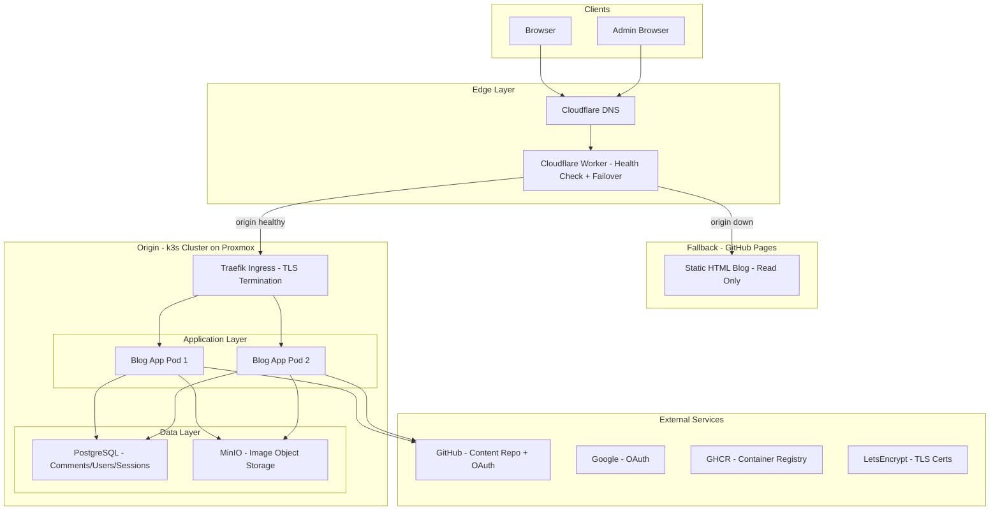
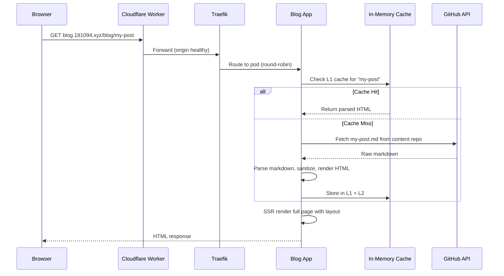
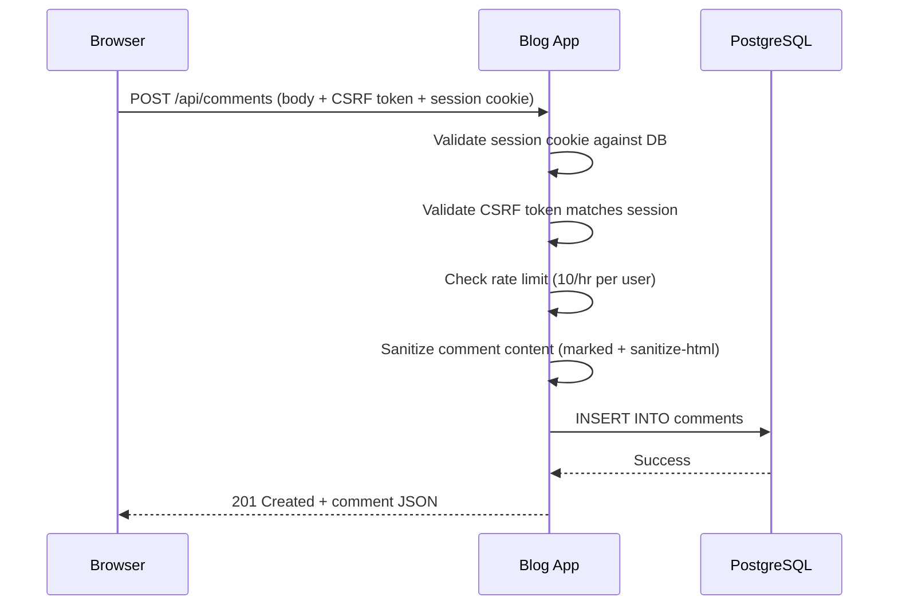
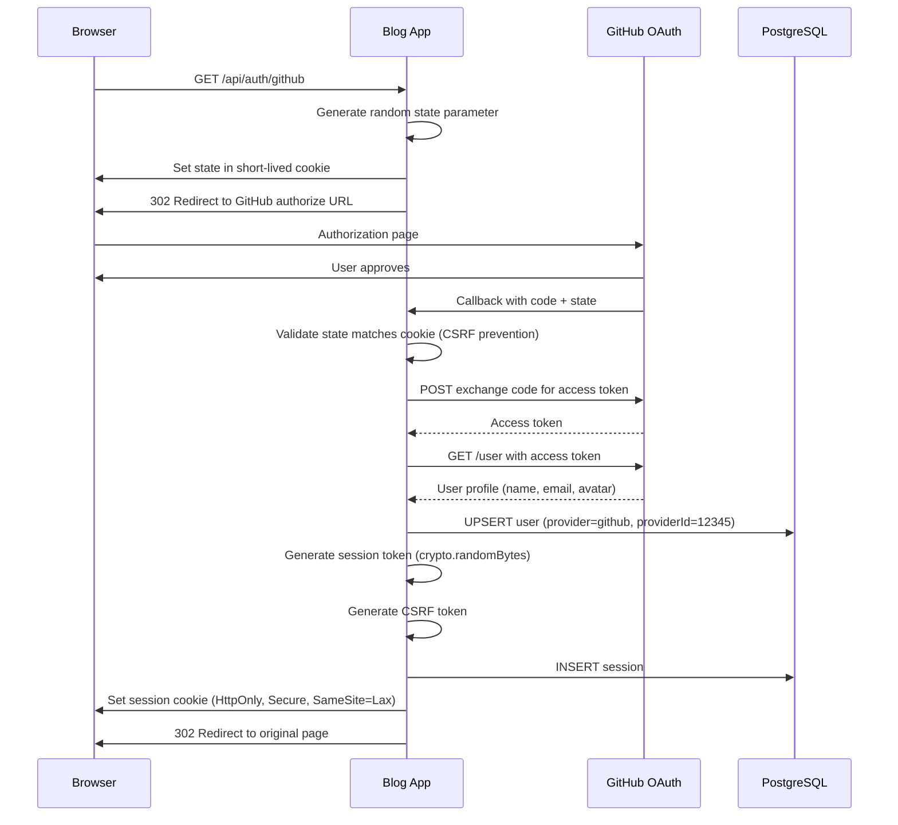
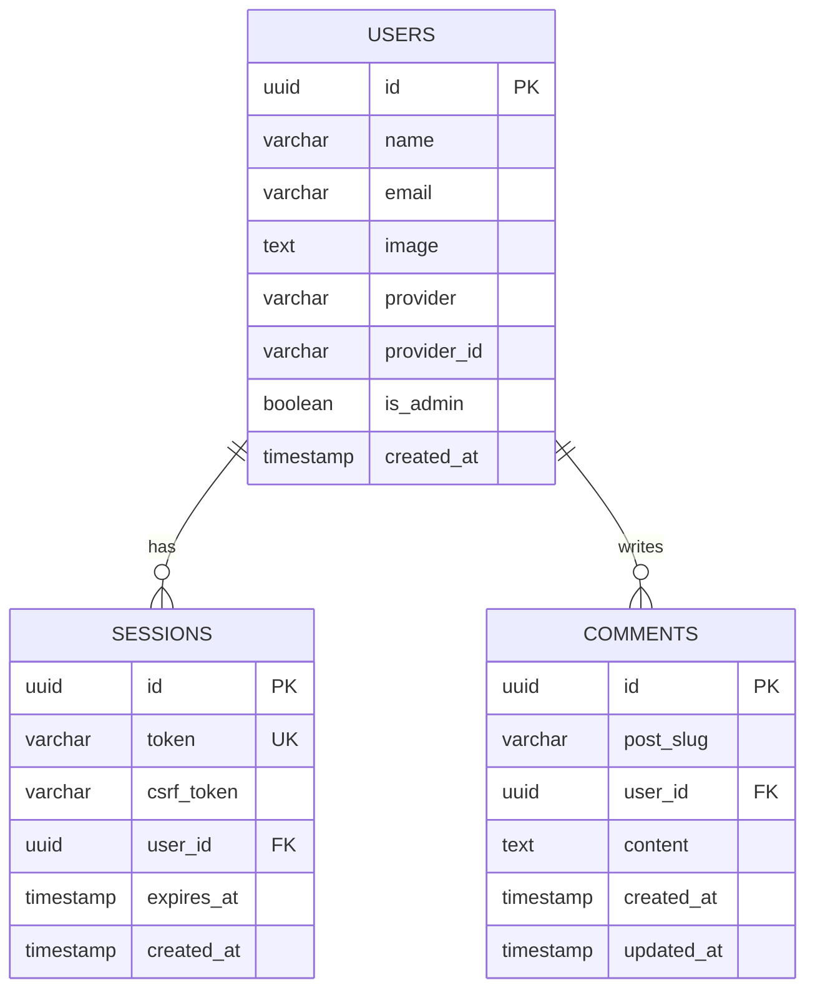
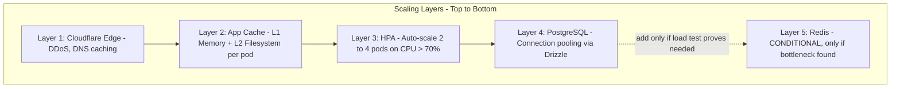
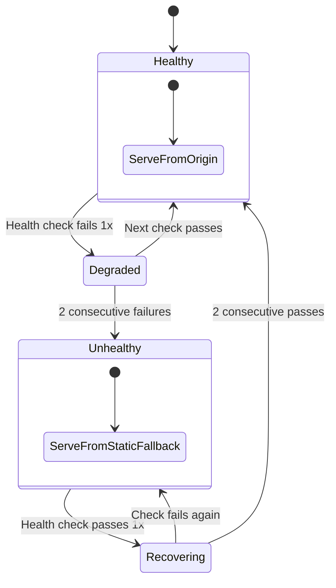

# High Level Design (HLD)

## Problem Statement

> "Design a self-hosted blog platform with server-side rendering, OAuth-based commenting, image storage, and automatic failover -- running on a 2-node Kubernetes cluster on consumer hardware with unreliable power."

## Functional Requirements

1. **Blog post management**: Create, edit, delete posts via an admin panel. Posts stored as Markdown.
2. **Server-side rendering**: Blog posts rendered on the server for SEO and performance.
3. **Authentication**: Admin login (credential-based), reader login (OAuth -- GitHub, Google).
4. **Comments**: Authenticated readers can post comments on blog posts. Admin can moderate.
5. **Image hosting**: Upload and serve images for blog posts via S3-compatible object storage.
6. **Content backup**: Blog content survives total infrastructure failure.
7. **Static fallback**: Blog remains readable when the server is offline.

## Non-Functional Requirements

1. **Availability**: Auto-failover to static site when primary server is down. Target: content always readable.
2. **Latency**: Blog post render < 200ms (SSR from cache). First byte < 100ms for cached content.
3. **Scalability**: Horizontal pod autoscaling. Handle traffic spikes via replica scaling.
4. **Security**: CSRF protection, input sanitization, rate limiting, secure session management.
5. **Durability**: Content stored in Git (distributed, versioned). Database backed up every 6 hours.
6. **Resilience**: Survive power outages (battery-backed nodes), network blips (graceful k8s recovery).

## Capacity Estimation

```
Expected traffic:    ~1,000 daily visitors (personal blog)
Peak traffic:        ~10,000/day (if a post hits Hacker News)
Average post size:   ~15KB HTML (rendered markdown + styles)
Images per post:     3-5, average 500KB each
Total posts (year 1): ~20-30 posts
Comment rate:        ~5-10 per day average

Storage:
  Blog content:      < 10MB (markdown in Git)
  Images:            ~500MB (year 1, MinIO)
  Database:          < 100MB (comments, users, sessions)

Compute:
  SSR render:        ~10ms per page (from cache)
  OAuth flow:        ~500ms (external provider round-trip)
  Comment write:     ~50ms (DB insert + sanitization)
```

## High-Level Architecture Diagram



## Component Responsibilities

| Component | Responsibility | Failure Impact |
|---|---|---|
| **Cloudflare Worker** | Edge health checking, failover routing, DDoS filtering | If Worker fails: direct DNS to origin (no failover but blog works) |
| **Traefik Ingress** | TLS termination, load balancing across pods, HTTP routing | If Traefik fails: blog unreachable, Cloudflare routes to fallback |
| **Blog App (Astro SSR)** | SSR rendering, OAuth flows, API endpoints. Stateless. | If all pods fail: failover to static site |
| **PostgreSQL** | Users, sessions, comments, rate limits | If PG fails: blog posts still render from cache (read-only degradation), no auth/comments |
| **MinIO** | S3-compatible image storage, presigned URLs | If MinIO fails: image uploads fail, existing presigned URLs may still work from browser cache |
| **GitHub** | Content source of truth, OAuth provider, container registry | If GitHub API down: serve from cache, OAuth unavailable |

## Data Flow Diagrams

### Reader visits a blog post



### Reader posts a comment



### OAuth login flow



## API Design

| Method | Endpoint | Auth | Description |
|---|---|---|---|
| GET | `/blog/[slug]` | None | SSR blog post page |
| GET | `/api/health` | None | Health check (DB, cache, MinIO status) |
| GET | `/api/auth/github` | None | Start GitHub OAuth flow |
| GET | `/api/auth/google` | None | Start Google OAuth flow |
| POST | `/api/auth/logout` | Session | Destroy session |
| GET | `/api/auth/me` | Session | Current user info |
| GET | `/api/comments?slug=X` | None | List comments for a post |
| POST | `/api/comments` | Session + CSRF | Create comment |
| DELETE | `/api/comments/[id]` | Session + CSRF | Delete (owner or admin) |
| POST | `/api/images/upload` | Admin | Upload image to MinIO |
| GET | `/api/images/[key]` | None | Redirect to MinIO presigned URL |
| POST | `/api/webhook` | Webhook Secret | GitHub content push notification |

## Database Schema



## Technology Choices

| Layer | Choice | Why (not) alternatives |
|---|---|---|
| **SSR** | Astro 5 | Content-first, native Markdown, generates static fallback. Not Next.js: heavier, React dependency. |
| **Database** | PostgreSQL 17 | ACID for comments/sessions, mature. Not SQLite: need concurrent access from multiple pods. |
| **ORM** | Drizzle | Type-safe SQL, lightweight. Not Prisma: heavier, slower cold starts. |
| **Object Storage** | MinIO | S3-compatible, self-hosted. Not local filesystem: not shared across pods. |
| **Container Build** | Podman | Rootless, daemonless. Not Docker: aligns with Red Hat ecosystem. |
| **Orchestration** | k3s | 512MB RAM. Not MicroK8s: 800MB+. Not full k8s: too heavy. QEMU VMs on Proxmox. |
| **TLS** | cert-manager + LE | Auto-renewal, DNS-01 works behind NAT. Not manual certs: expire and break. |
| **Edge** | Cloudflare Worker | Free tier, programmable failover. Not Cloudflare LB: paid. |
| **Auth** | Hand-built | Learning goal. Not Auth.js: black box, defeats the purpose. |

## Scalability Strategy



## Availability Design

| Failure | Detection | Response | Recovery Time |
|---|---|---|---|
| Single pod crash | Liveness probe (20s interval) | k8s restarts pod, other pod serves | ~30s |
| One laptop loses power | Node becomes NotReady (40s timeout) | Pods rescheduled to surviving node | ~5 min |
| Both laptops lose power | Cloudflare health check fails (2x 30s) | Worker routes to GitHub Pages static | ~60-90s to failover |
| Internet drops | External health check fails | Cloudflare routes to fallback | ~60-90s |
| PostgreSQL crash | Readiness probe fails | Blog serves from cache (read-only) | ~30s (k8s restart) |
| MinIO crash | Readiness probe fails | Image uploads fail, cached images OK | ~30s (k8s restart) |

## Failover State Machine



## How to Present This in an Interview

**Opening (1 minute):** "I built and operate a self-hosted blog platform on a 2-node Kubernetes cluster running on consumer hardware in my home. The interesting constraints are unreliable power and internet, so I had to design for resilience at every layer -- from the physical infrastructure up to automatic CDN failover."

**Walk the HLD (5-7 minutes):** Draw the architecture diagram. Explain each component and why it exists. Emphasize the tradeoffs: why k3s over full k8s (RAM constraints), why MinIO over S3 (self-hosted, learning), why hand-built auth over Auth.js (understanding vs. convenience).

**Deep dive areas they might ask (5-10 minutes):**

- **"How does auth work?"** -- Walk the OAuth2 sequence diagram. Explain state parameter for CSRF on OAuth. Explain cookie properties (HttpOnly, Secure, SameSite).
- **"How do you handle scaling?"** -- HPA, resource limits, load testing with k6. Explain why no Redis by default (premature optimization -- only add when load test proves it's needed).
- **"What happens when the server goes down?"** -- Walk the failover state machine. Cloudflare Worker health checks, static fallback, graceful degradation.
- **"How do you handle caching?"** -- L1/L2 cache diagram. ETags, stale-while-revalidate, webhook invalidation with polling fallback.
- **"What about data durability?"** -- Content in Git (survives total loss). DB backed up every 6h. MinIO on persistent volumes.

**The differentiator (1 minute):** "The physical layer is what makes this interesting. The nodes are laptops because they have built-in batteries -- they're UPS units that also run containers. The networking uses wired routers across a duplex with individual UPS backup. I designed the system to survive the constraints of my actual environment, not a theoretical one."
