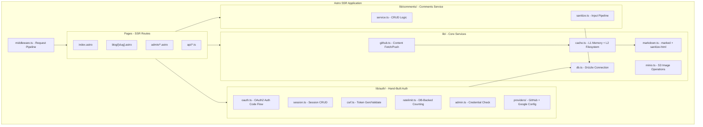
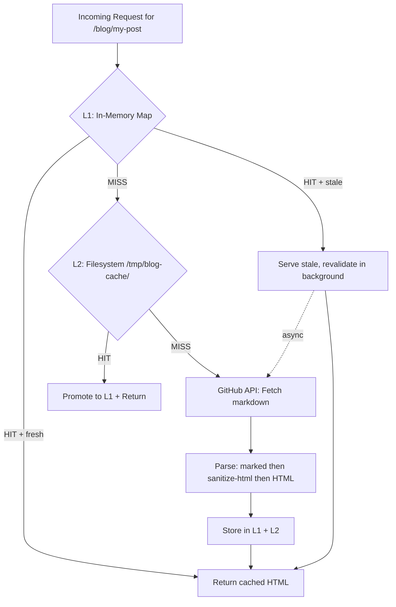
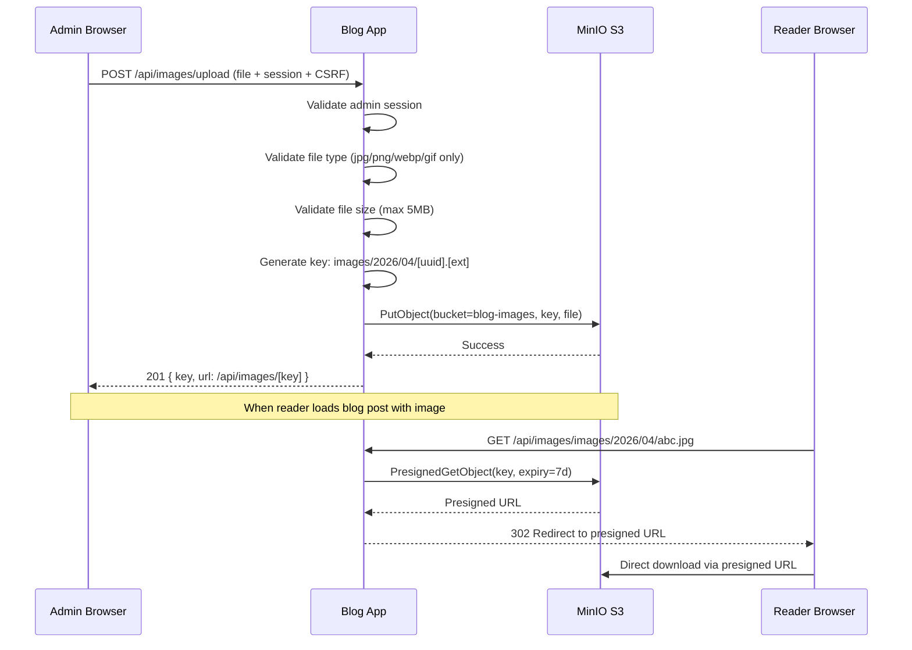

# Low Level Design (LLD)

## Module Architecture



## Detailed Database Schema with Indexes

```sql
-- Users table
CREATE TABLE users (
    id UUID PRIMARY KEY DEFAULT gen_random_uuid(),
    name VARCHAR(255) NOT NULL,
    email VARCHAR(255),
    image TEXT,
    provider VARCHAR(50) NOT NULL,
    provider_id VARCHAR(255) NOT NULL,
    is_admin BOOLEAN DEFAULT FALSE,
    created_at TIMESTAMPTZ DEFAULT NOW(),
    UNIQUE(provider, provider_id)
);
CREATE INDEX idx_users_provider ON users(provider, provider_id);

-- Sessions table
CREATE TABLE sessions (
    id UUID PRIMARY KEY DEFAULT gen_random_uuid(),
    token VARCHAR(64) NOT NULL UNIQUE,
    csrf_token VARCHAR(64) NOT NULL,
    user_id UUID NOT NULL REFERENCES users(id) ON DELETE CASCADE,
    expires_at TIMESTAMPTZ NOT NULL,
    created_at TIMESTAMPTZ DEFAULT NOW()
);
CREATE INDEX idx_sessions_token ON sessions(token);
CREATE INDEX idx_sessions_expires ON sessions(expires_at);
CREATE INDEX idx_sessions_user ON sessions(user_id);

-- Comments table
CREATE TABLE comments (
    id UUID PRIMARY KEY DEFAULT gen_random_uuid(),
    post_slug VARCHAR(255) NOT NULL,
    user_id UUID NOT NULL REFERENCES users(id) ON DELETE CASCADE,
    content TEXT NOT NULL,
    created_at TIMESTAMPTZ DEFAULT NOW(),
    updated_at TIMESTAMPTZ
);
CREATE INDEX idx_comments_slug ON comments(post_slug, created_at);
CREATE INDEX idx_comments_user ON comments(user_id);
```

### Index Rationale

- `idx_sessions_token`: Every authenticated request does `WHERE token = $1`. B-tree on unique varchar gives O(log n) lookup. This is the hottest query in the system.
- `idx_comments_slug`: `WHERE post_slug = $1 ORDER BY created_at` is the most frequent comment query. Composite index covers both filter and sort without a filesort.
- `idx_sessions_expires`: Cleanup job runs `DELETE WHERE expires_at < NOW()`. Without this, it's a full sequential scan.
- `UNIQUE(provider, provider_id)`: Prevents duplicate accounts from the same OAuth provider. Enforced at the database level, not just application level.

## Caching Architecture



### Cache Invalidation Strategy

1. **Webhook**: GitHub push to content repo -> `POST /api/webhook` -> `cache.invalidateAll()` -> next request repopulates
2. **Polling fallback**: Every 5 min, check GitHub API for new commits. If found, invalidate. (Catches missed webhooks during power blips)
3. **ETags**: On revalidation, send `If-None-Match` with stored ETag. GitHub returns `304 Not Modified` if unchanged -- saves bandwidth and API quota.
4. **Stale-while-revalidate**: When L1 TTL expires, serve stale content immediately and revalidate in background. Reader never waits for GitHub API.

### Per-Pod vs Shared Cache

- L1 is per-pod (in-memory Map). Pod 1 and Pod 2 have independent caches.
- With 2 pods and round-robin load balancing, worst case is 2x GitHub API calls on cache miss (once per pod).
- For ~20-30 blog posts, this is negligible. Total cached content < 1MB per pod.
- If this becomes a problem at scale (visible via monitoring): add Redis as shared L1 cache.

## Auth Module Pseudocode

### OAuth2 Provider-Agnostic Flow

```typescript
// lib/auth/oauth.ts

interface OAuthProvider {
  name: string;
  authorizeUrl: string;
  tokenUrl: string;
  profileUrl: string;
  clientId: string;
  clientSecret: string;
  scopes: string[];
  mapProfile: (raw: any) => { id: string; name: string; email: string; image: string };
}

function getAuthorizationUrl(provider: OAuthProvider, state: string): string {
  const params = new URLSearchParams({
    client_id: provider.clientId,
    redirect_uri: `https://blog.181094.xyz/api/auth/${provider.name}`,
    scope: provider.scopes.join(' '),
    state,
    response_type: 'code',
  });
  return `${provider.authorizeUrl}?${params}`;
}

async function handleOAuthCallback(provider: OAuthProvider, code: string) {
  const tokenRes = await fetch(provider.tokenUrl, {
    method: 'POST',
    headers: { 'Content-Type': 'application/json', Accept: 'application/json' },
    body: JSON.stringify({
      client_id: provider.clientId,
      client_secret: provider.clientSecret,
      code,
      redirect_uri: `https://blog.181094.xyz/api/auth/${provider.name}`,
    }),
  });
  const { access_token } = await tokenRes.json();

  const profileRes = await fetch(provider.profileUrl, {
    headers: { Authorization: `Bearer ${access_token}` },
  });
  return provider.mapProfile(await profileRes.json());
}
```

### Session Management

```typescript
// lib/auth/session.ts
import crypto from 'node:crypto';

function generateToken(): string {
  return crypto.randomBytes(32).toString('hex');
}

async function createSession(userId: string) {
  const token = generateToken();
  const csrfToken = generateToken();
  const expiresAt = new Date(Date.now() + 7 * 24 * 60 * 60 * 1000);
  await db.insert(sessions).values({ token, csrfToken, userId, expiresAt });
  return { token, csrfToken };
}

async function validateSession(token: string) {
  const [session] = await db.select().from(sessions)
    .innerJoin(users, eq(sessions.userId, users.id))
    .where(and(eq(sessions.token, token), gt(sessions.expiresAt, new Date())));
  return session ?? null;
}

async function destroySession(token: string) {
  await db.delete(sessions).where(eq(sessions.token, token));
}
```

### Middleware Pipeline

```typescript
// lib/auth/middleware.ts
export async function onRequest({ request, cookies, locals }, next) {
  // 1. Session lookup
  const token = cookies.get('session')?.value;
  if (token) {
    const session = await validateSession(token);
    if (session) {
      locals.user = session.user;
      locals.session = session;
    } else {
      cookies.delete('session');
    }
  }

  // 2. Admin route protection
  if (request.url.includes('/admin') && !locals.user?.isAdmin) {
    return new Response(null, { status: 302, headers: { Location: '/admin/login' } });
  }

  // 3. CSRF on state-changing requests
  if (['POST', 'PUT', 'DELETE'].includes(request.method)) {
    const csrfToken = request.headers.get('x-csrf-token');
    if (!locals.session || csrfToken !== locals.session.csrfToken) {
      return new Response('CSRF validation failed', { status: 403 });
    }
  }

  // 4. Rate limiting
  if (request.method === 'POST' && request.url.includes('/api/comments')) {
    const allowed = await checkRateLimit(locals.user.id, 'comment', 10, 60);
    if (!allowed) return new Response('Rate limit exceeded', { status: 429 });
  }

  return next();
}
```

## Image Upload Flow



## Kubernetes Resource Budget

```
Laptop 1 QEMU VM (k3s-server, 1280MB):
  k3s control plane:    ~300MB (API server, scheduler, controller-manager, SQLite)
  Traefik:              ~80MB
  cert-manager:         ~100MB
  PostgreSQL:           256MB (limit)
  Blog Pod 1:           256MB (limit)
  Buffer:               ~288MB

Laptop 2 QEMU VM (k3s-agent, 1280MB):
  k3s agent:            ~200MB (kubelet, flannel, kube-proxy)
  MinIO:                256MB (limit)
  Blog Pod 2:           256MB (limit)
  Buffer:               ~568MB (absorbs HPA scaling to pod 3 or 4)
```

## Security Layers

```
Request flow through security:

Browser Request
    |
    +-- Cloudflare: DDoS protection, DNS filtering
    |
    +-- Traefik: TLS termination, HTTPS enforcement, HSTS
    |
    +-- Astro Middleware:
    |   +-- Session validation (cookie -> DB lookup -> attach user)
    |   +-- Admin route protection (redirect if not admin)
    |   +-- CSRF token validation (on POST/PUT/DELETE)
    |   +-- Rate limiting (DB-backed counter per user/IP)
    |
    +-- API Endpoint:
    |   +-- Input validation (type checking, length limits)
    |   +-- Content sanitization (marked -> sanitize-html, strict whitelist)
    |   +-- Authorization checks (ownership for delete)
    |
    +-- Database:
        +-- Parameterized queries via Drizzle (SQL injection prevention)
        +-- Unique constraints (prevent duplicate accounts)
        +-- Foreign keys with CASCADE (referential integrity)
```
